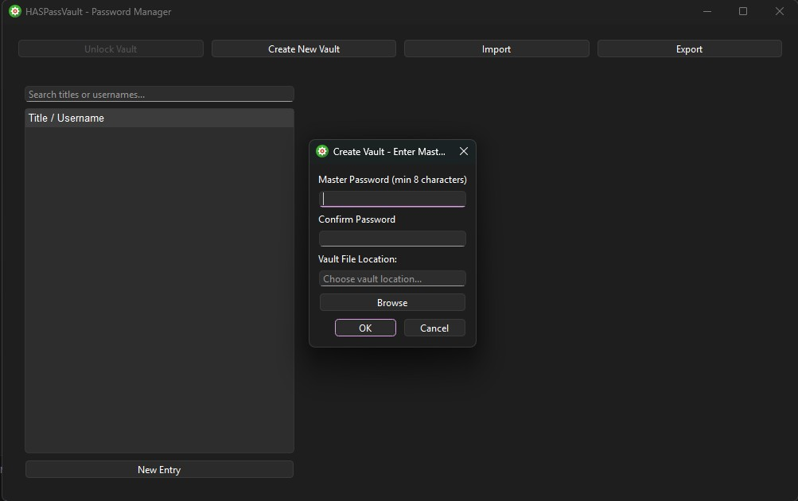
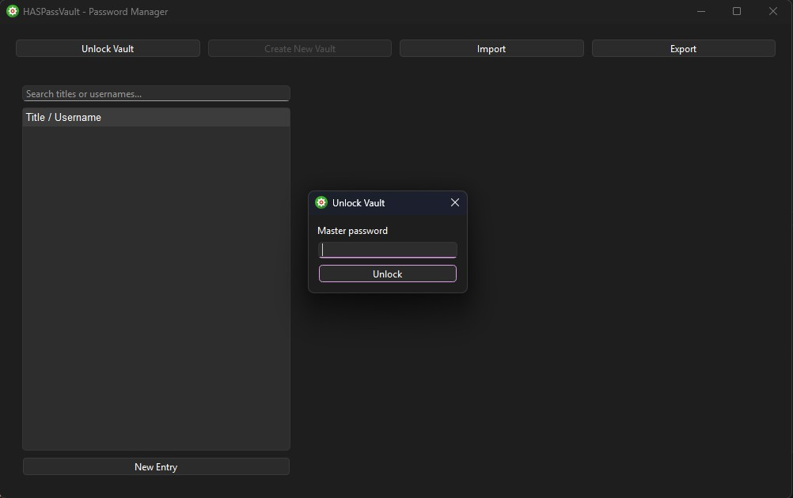
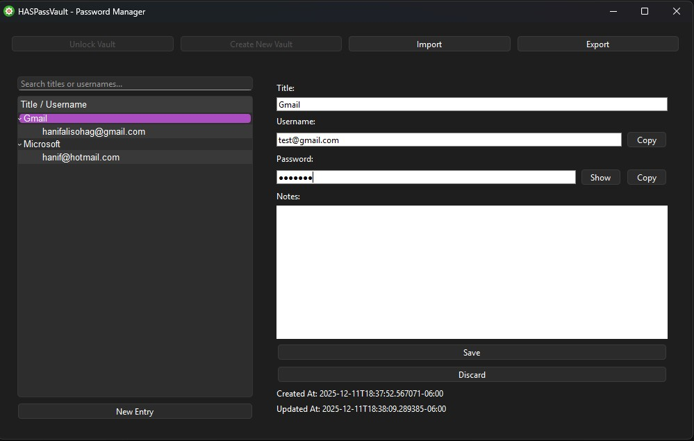
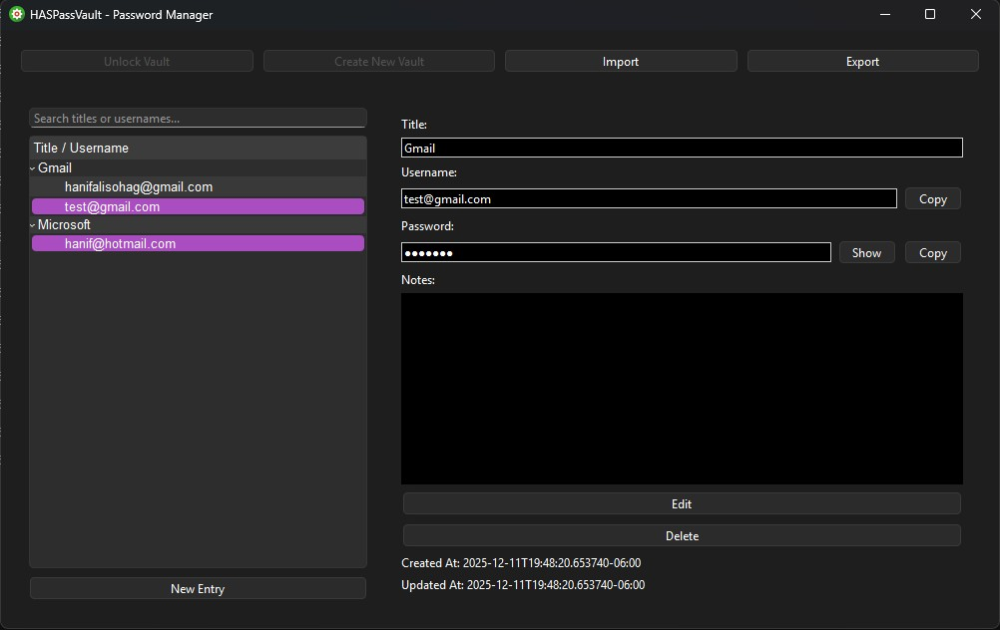

# HASPassVault - Python Desktop Password Manager

A secure, cross-platform password manager built with Python, PyQt6, and SQLite.

## Features

- Cross-platform: Windows, Linux, macOS
- AES-256-GCM encryption with Argon2id key derivation
- Local encrypted SQLite storage
- Add, edit, delete, and view passwords
- Zero-knowledge: master password never stored on disk

## Setup

1. Create a virtual environment (recommended):

```bash
python -m venv venv
# Windows
venv\Scripts\activate
# macOS/Linux
source venv/bin/activate
```

2. Install dependencies:
```bash
pip install -r requirements.txt
```

3. Run the application:
```bash
python main.py
```

## Packaging

Install PyInstaller:
```bash
pip install pyinstaller
```

Build a one-folder app:
```bash
pyinstaller --noconfirm --onedir --windowed main.py
```
Build One Exe
```bash
pyinstaller --onefile --windowed --name HASPassVault --icon "./resources/icons/main_logo.ico" --add-data "resources;resources" main.py
```

## Demo
*Create the Vault*



*Unlock the Vault*



*Adding New Entry*



*Display the Entry*

